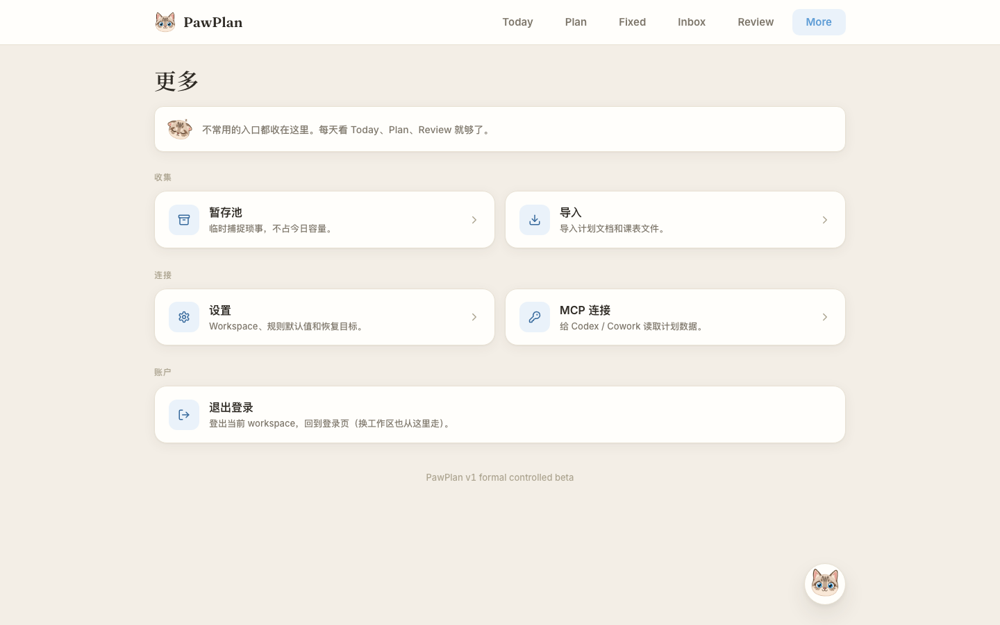

# 🐾 PawPlan

> An invite-gated, schedule-first planning app that turns external agent work into safe, reviewable plans.

[](https://pawplan.charlottezmm.info)
[](https://nextjs.org)
[](https://orm.drizzle.team)
[](#-mcp-server)
[](#-license)

**🔗 Production:** [pawplan.charlottezmm.info](https://pawplan.charlottezmm.info)

PawPlan is built for one workflow: Claude, Codex, or another external agent can read planning context and draft changes — but **PawPlan owns validation, persistence, Review, audit trails, and readback**. A task move isn't real until you review and apply it in the app.



_Preview captured from a local test session; no real workspace data is shown._

---

## 📑 Contents

- [Why PawPlan](#-why-pawplan)
- [Core Workflow](#-core-workflow)
- [Quickstart](#-quickstart)
- [What's Included](#-whats-included)
- [What's Not Included](#-whats-not-included)
- [Architecture](#-architecture)
- [MCP Server](#-mcp-server)
- [Production Smoke](#-production-smoke)
- [中文说明](#-中文说明)
- [License](#-license)

---

## 🎯 Why PawPlan

Most planning tools only maintain a task list, and agents tend to produce changes that look good but aren't safely executable. PawPlan plans from a **real schedule** — fixed blocks, routines, courses, and capacity — instead of a blank list, and keeps every agent change behind Review.

It lets you:

- Capture tasks, chores, decisions, check-ins, and planning context.
- Keep protected schedule blocks, routines, courses, and capacity visible to agents.
- Let external agents propose daily or weekly rebalances **without** touching the plan directly.
- Show every agent change as a Review draft before anything is applied.
- Record each agent run with status, idempotency, structured outputs, failures, and readback.
- Hold life-admin items in Inbox until you promote them into scheduled work.

> **Status:** PawPlan v1 formal is a *controlled beta* — usable for invited workspaces, not public GA. The old static May dashboard prototype is preserved at `docs/legacy/index-static-dashboard.html`.

## 🔄 Core Workflow

1. You record tasks, fixed schedule, routines, and constraints in PawPlan.
2. An external agent reads context through MCP.
3. The agent proposes a change via a narrow tool like `propose_daily_rebalance` or `propose_week_rebalance`.
4. PawPlan creates an **idempotent Review draft** and records the agent run.
5. You open `/review`, check the draft, and apply or reject it.
6. PawPlan persists the final state and exposes **readback** so agent success is verifiable.

This is intentionally **preview-first**: Review, draft, suggestion, and brief are never treated as applied work.

## 🚀 Quickstart

```bash
npm install                       # install dependencies
cp .env.example .env.local        # then set the vars below
npm run db:migrate                # run migrations
npm run dev                       # start the app
```

Required env (`.env.local`):

| Variable | Notes |
| --- | --- |
| `DATABASE_URL` | Postgres connection string |
| `APP_SECRET` | App secret |
| `NEXT_PUBLIC_APP_NAME` | Set to `PawPlan` for the current product |

Verify before shipping:

```bash
npm run test
npm run build
npm run test:e2e
```

## 📦 What's Included

- Web + PWA planning surface (Next.js App Router frontend and API routes).
- Postgres data layer with Drizzle migrations.
- Invite-code workspace creation + password login for existing workspaces.
- Hosted MCP endpoint for Codex bearer-token clients, plus a Claude Custom Connector OAuth adapter.
- Today, Week, Month, Inbox, Fixed Schedule, Review, Import, and Settings surfaces.
- Inbox capture for life-admin items and promotion into planned work.
- Agent run status, idempotency, failure visibility, and draft readback.
- Review-confirmed task changes, daily/weekly rebalance drafts, and timetable imports.
- Settings observability for hosted MCP tokens, routines, and workspace controls.

## 🚫 What's Not Included

PawPlan v1 formal deliberately leaves these out:

- App-owned LLM calls or embedded AI chat.
- App-owned scheduler, server cron, browser timer, or PWA background rescheduler.
- Automatic patch apply.
- Billing, team collaboration, and public open signup.
- Google / Apple / Outlook Calendar sync.
- Full drag-and-drop calendar editing.

External agents can schedule *themselves* outside PawPlan. PawPlan remains the product-owned data, validation, Review, and audit layer.

## 🏗 Architecture

A Next.js + Postgres app with a narrow MCP boundary between it and external agents.

| Path | Responsibility |
| --- | --- |
| `src/app` | App Router pages and API routes |
| `src/components` | UI for planning, inbox, review, settings, imports |
| `src/lib/planning` | Planning services, view data builders, capacity, rebalance logic |
| `src/lib/agent-runs` | Agent run creation, idempotency, status transitions, readback |
| `src/lib/mcp` | MCP tool schemas, dispatch, hosted route helpers, server builder |
| `src/lib/settings` | Workspace settings and observability helpers |
| `drizzle` | Schema migrations and snapshots |
| `docs` | Automation guides, beta smoke checklists, connector docs, specs |

**The core reliability rule:** *tool invocation success is not business success.* PawPlan checks structured return values and reads back persisted state.

## 🔌 MCP Server

PawPlan exposes both a local stdio server and a hosted endpoint.

```bash
npm run mcp                       # local stdio server
```

```text
https://pawplan.charlottezmm.info/api/mcp   # hosted endpoint
```

Local MCP requires `DATABASE_URL` and `PAWPLAN_WORKSPACE_ID`.

The surface is intentionally narrow: agents read context, write audited low-risk records, or create Review drafts. They **cannot** edit protected constraints, apply drafts, or own scheduled automation.

<details>
<summary><strong>Tool reference</strong> (9 read · 11 write/draft)</summary>

**Read** — `get_today` · `get_week` · `get_month` · `get_constraints` · `get_capacity` · `get_decisions` · `get_conversations` · `get_checkins` · `get_tasks`

**Write & draft** — `create_inbox_item` · `create_checkin` · `update_task_status` · `update_task_schedule` · `update_task_notes` · `save_conversation_summary` · `record_decision` · `propose_patch` · `propose_daily_rebalance` · `propose_week_rebalance` · `propose_timetable_import` · `import_plan_bundle`

</details>

Daily/weekly automation is configured **outside** PawPlan (Codex / Cowork / Claude): the agent reads through MCP, proposes changes with Review-safe tools, and waits for you to confirm in `/review`. See `docs/automation/pawplan-scheduled-automation.md`.

## ✅ Production Smoke

Before sharing an invite, run the smoke checklist at `docs/public-beta/2026-06-13-public-beta-smoke-checklist.md`. Daily agent loop prompts live at `docs/public-beta/2026-06-13-daily-agent-loop-prompts.md`.

Connector guides: `connect-codex.md` · `connect-claude.md` · `review-safety.md` · `agent-runs-troubleshooting.md` (all under `docs/public-beta/`).

---

## 🐾 中文说明

> PawPlan 是一个邀请制、以日程为中心的计划应用，把外部 Agent 的建议变成**可审查、可回读、可安全落地**的计划草稿。

**🔗 生产地址：** [pawplan.charlottezmm.info](https://pawplan.charlottezmm.info)

它不是通用 AI 聊天应用，也不是自动改日程的黑盒调度器。核心边界很简单：Claude、Codex 等外部 Agent 可以**读取上下文、提建议、生成 Review 草稿**；而数据校验、持久化写入、Review 审核、审计记录和最终 readback 都由 PawPlan 后端负责。任务移动只有在用户进入 `/review` 审核确认后才真正生效。

**当前阶段：** v1 formal 是 *controlled beta*（受控邀请测试版），目标不是开放注册或商业化，而是把个人计划闭环做稳——读取真实日程、生成可审查草稿、确认后落库、失败可见、结果可回读。旧版静态 May dashboard 原型保存在 `docs/legacy/index-static-dashboard.html`。

### 核心流程

1. 用户在 PawPlan 维护任务、固定安排、routine 和约束。
2. 外部 Agent 通过 MCP 读取上下文。
3. Agent 调用 `propose_daily_rebalance`、`propose_week_rebalance` 等窄工具提修改。
4. PawPlan 创建幂等的 Review 草稿，并记录 agent run。
5. 用户进入 `/review` 检查草稿，应用或拒绝。
6. PawPlan 落库最终状态并提供 readback，让“成功”可被验证。

原则是 **preview-first**：Review、draft、suggestion、brief 都不是已应用结果，只有持久化记录和读回状态才算完成。

<details>
<summary><strong>能力清单 / 暂不包含 / 技术结构</strong>（点击展开）</summary>

**已包含**

- Web + PWA 计划界面（Next.js App Router 前端 + API routes）。
- Postgres + Drizzle 数据层和 migrations。
- 邀请码创建 workspace，已有 workspace 密码登录。
- 给 Codex bearer-token client 的 hosted MCP endpoint，以及 Claude Custom Connector OAuth adapter。
- Today / Week / Month / Inbox / Fixed Schedule / Review / Import / Settings 主要界面。
- Inbox life-admin capture 和 promotion。
- Agent run 状态、幂等、失败可见、draft readback。
- Review-confirmed task changes、daily/weekly rebalance drafts、timetable imports。
- Settings 中的 MCP token、routine、workspace 控制和可观察性。

**暂不包含**

- 应用内置 LLM 调用或 AI chat。
- 应用内置 scheduler、server cron、browser timer 或 PWA background rescheduler。
- 自动应用 Agent 草稿。
- Billing、Team collaboration、Public open signup。
- Google / Apple / Outlook Calendar sync。
- 复杂拖拽日历编辑。

外部 Agent 可在 Codex / Cowork / Claude 里自行定时运行；PawPlan 只负责数据、校验、Review 和审计边界。

**技术结构** — Next.js + Postgres，MCP 是它和外部 Agent 之间的受控边界。

- `src/app`：App Router 页面和 API routes。
- `src/components`：计划 / Inbox / Review / Settings / Import 等 UI。
- `src/lib/planning`：计划服务、view data、capacity、rebalance 逻辑。
- `src/lib/agent-runs`：agent run 创建、幂等、状态流转、readback。
- `src/lib/mcp`：MCP tool schema、dispatch、hosted route helper、server builder。
- `src/lib/settings`：workspace settings 和可观察性服务。
- `drizzle`：数据库 migration 和 schema snapshot。
- `docs`：自动化说明、beta smoke、MCP connector 文档、实现方案。

可靠性底线：**工具调用成功 ≠ 业务成功**。PawPlan 必须看结构化返回值并读回最终状态。

</details>

### 本地开发

```bash
npm install
cp .env.example .env.local        # 设置 DATABASE_URL / APP_SECRET / NEXT_PUBLIC_APP_NAME(=PawPlan)
npm run db:migrate
npm run dev
```

验证：`npm run test` · `npm run build` · `npm run test:e2e`

---

## 📄 License

Code is **MIT**. Content is **CC-BY 4.0**.
